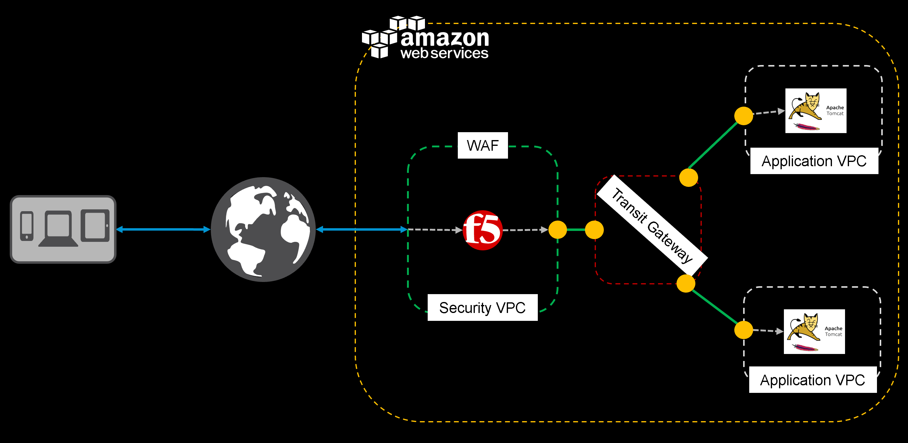

# F5 WAF with AWS TGW POC

## Introduction

Weclome.  The above referenced CFT deploys a proof-of-concept environment as shown below.  Configuration values, (with the exception of a pre-existing SSH key pair) are hard set.

**Important**: You may have to select the AWS region in which you want to deploy after clicking the Launch Stack button
  
**Lauch the POC Builder Template**
- *Existing Stack* which includes an external IP address (typical)
  - <a href="https://github.com/F5Networks/f5-aws-cloudformation/tree/master/supported/standalone/1nic/existing-stack/payg">**Hourly**</a>, which uses pay-as-you-go hourly billing 
    
