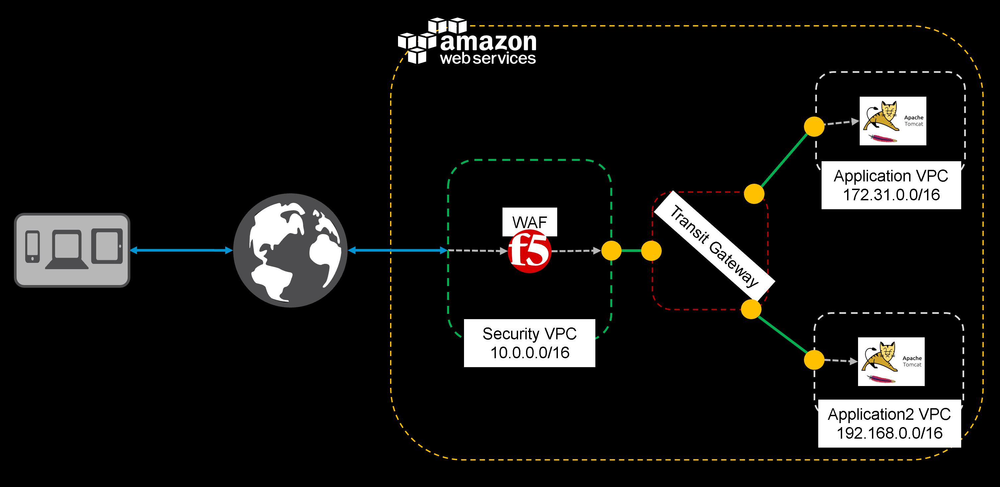

<html>
<h1>F5 WAF with AWS TGW POC</h1>
   
<body>The above referenced CFT deploys a proof-of-concept environment as shown below.  Configuration values, (with the exception of a pre-existing SSH key pair) are hard coded. 

  
 List of Supported F5 CloudFormation templates for AWS deployments
The following is a list of the current supported F5 CloudFormation templates. See the experimental directory for experimental templates. Click the links to view the README files which include the Launch buttons and additional information, or click the Launch Stack buttons to immediately launch the stack. Because individual templates may have specific prerequisites, we strongly recommend you view the README file before attempting to launch a template.

Important: You may have to select the AWS region in which you want to deploy after clicking the Launch Stack button 

Standalone BIG-IP VE - Single NIC

Existing Stack which includes an external IP address (typical)

Hourly, which uses pay-as-you-go hourly billing 

</body>
</html>
